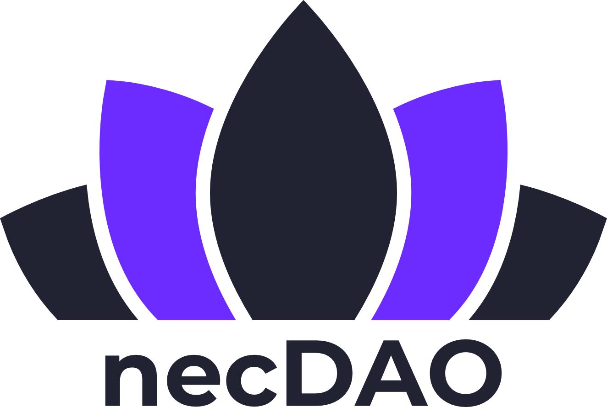

# necDAO visual assets

## Purpose

This repository provides an open library of useful assets for promotion of the
Nectar Community DAO (necDAO).

To learn more about the necDAO, and to participate, visit https://nectar.community/dao

## Contributing

Please make a Pull Request to add new assets.

This is an open initiative. If you are interested in becoming a maintainer of this
repository on behalf of necDAO, please email ben@deversifi.com

## Colour Palettes

1. Primary

-  `#141731 - DARK BLUE`
-  `#222332 - DARK GREY`
-  `#6326FF - BRIGHT PURPLE`
-  `#3130F1 - BRIGHT BLUE`

2. Secondary

-  `#1C0157 - DARK PURPLE`
-  `#00F0B5 - LIGHT GREEN`
-  `#5ff7fc - LIGHT BLUE`
-  `#5866D2 - Nectar ASH BLUE`

3. Tertiary

-  `#E5247A - MAGENTA`
-  `#F06FFB - LIGHT PINK`
-  `#FE685A - ORANGE`
-  `#0F7FFA - LIGHT BLUE`
